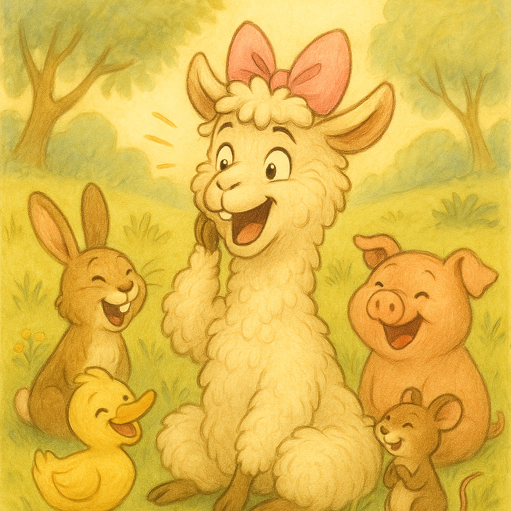

Das Drama-Lama Isi

In einem bunten Tal voller Blumen und Schmetterlinge lebte ein Lama namens Isi. Aber Isi war kein normales Lama. Nein! Sie war ein Drama-Lama. Wenn etwas nicht genau so lief, wie sie wollte, rief sie: „Ooooh nein! Eine Katastrophe!“

Eines Morgens wollte Isi Möhren frühstücken. Doch es gab nur Äpfel. Sie warf sich auf den Boden und rief: „Ich kann doch keine Äpfel essen! Ich werde verhungern!“ Die Schildkröte Tim schüttelte den Kopf und sagte: „Isi, ein Apfel ist auch lecker.“ Aber Isi jammerte weiter: „Das ist das Ende!“

Später wollte Isi im See planschen, aber eine Ente schwamm darin. „Oh nein, der See ist BESETZT! Ich kann nie wieder baden!“, rief sie. Die Ente schnatterte: „Du kannst doch einfach ein Stück weiter schwimmen.“ Doch Isi zog eine Show ab wie auf einer Theaterbühne.

Am nächsten Tag verlor Isi ihre rosa Schleife. „Meine Schleife ist weg! Jetzt bin ich nur noch ein normales Lama!“, schluchzte sie. Ihre Freunde suchten überall. Am Ende fanden sie die Schleife… auf Isis Kopf. Sie hatte sie gar nicht verloren!

Da lachten alle. Sogar Isi musste kichern. „Vielleicht übertreibe ich manchmal ein klitzekleines bisschen“, sagte sie. Ihre Freunde nickten. Aber sie mochten Isi trotzdem – auch wenn sie manchmal ein echtes Drama machte.

Und so lebte das Drama-Lama Isi weiter im Tal – mit vielen Abenteuern, ein bisschen Theater, und ganz viel Lachen.
